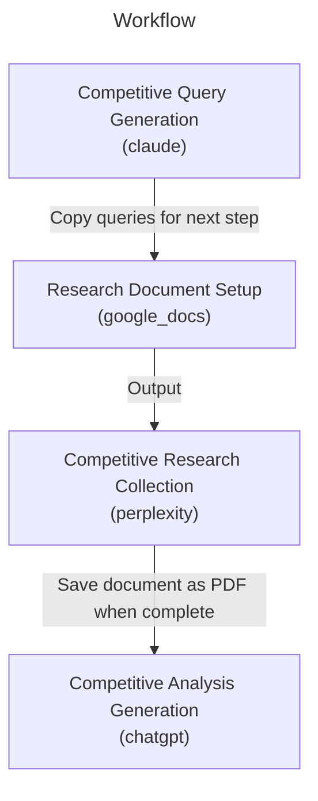

# Competitive Intelligence

# Competitive Intelligence Workflow

This workflow provides a systematic approach to competitive intelligence gathering and analysis, leveraging the unique capabilities of multiple AI tools to create comprehensive competitive analysis reports.

## Overview

The workflow combines three powerful AI tools in a synergistic manner:

- Claude's analytical capabilities for generating targeted research queries
- Perplexity's advanced research capabilities for gathering accurate, up-to-date competitive information
- ChatGPT's synthesis abilities for creating cohesive, insightful competitive analysis reports

## Key Benefits

1. **Structured Research Process**: The workflow follows a methodical approach, ensuring comprehensive coverage of all critical competitive aspects including market share, product comparisons, strategic positioning, and customer feedback.

2. **Data-Driven Analysis**: By leveraging Perplexity's research capabilities, the workflow ensures that all competitive insights are based on current, factual data rather than outdated or speculative information.

3. **Comprehensive Coverage**: The analysis covers multiple dimensions of competitive intelligence:
   - Market share and revenue analysis
   - Product and feature comparisons
   - Pricing strategies and models
   - Strategic positioning
   - Customer sentiment and feedback

4. **Actionable Insights**: The final output provides not just data, but actionable competitive intelligence that can inform strategic decision-making.

This workflow is particularly valuable for businesses needing to maintain a deep understanding of their competitive landscape, whether for strategic planning, product development, or market positioning purposes.


A systematic approach to competitive intelligence that combines Claude's query generation, Perplexity's research capabilities, and ChatGPT's synthesis to create comprehensive competitive analysis reports.

## Workflow



## Parameters

| Parameter | Required | Description | Example |
|-----------|----------|-------------|----------|
| company_name | No | Your company name for competitor analysis context | SimpliSafe |
| target_industry | No | The industry to analyze competitors in | US smart home security market |
| competitors | No | List of key competitors to focus on | ADT, Ring, Vivint |


## Tools Required

### perplexity


### chatgpt


### claude


### google_docs


## Workflow Steps
### 1. Competitive Query Generation

Generate focused competitor analysis queries

**Usage:**
1. Create a new conversation with Claude
2. Use the provided prompt template
3. Review and refine generated queries


**Output:** Save queries for use in the next step (2. Research Document Setup)

**Note:** Ensure queries cover market share, product comparison, strategy, financial performance, and customer feedback

### 2. Research Document Setup

Create and format Google Doc for research documentation

**Input:** Queries from the previous step (1. Competitive Query Generation)

**Usage:**
1. Create new Google Doc
2. Set title format: "[Date] - [Industry] - Competitive Analysis"
   Example: "2024-11-25 - Smart Home Security - Competitive Analysis"
3. For each query from the previous step (1. Competitive Query Generation):
   a. Paste query text
   b. Format as Heading 1
   c. Press Enter twice to leave space for response
   d. Ensure normal text formatting is set for response area


**Note:** Double-check formatting settings after each query addition

### 3. Research Data Collection

Execute research queries and document findings

**Input:** Queries from the previous step (2. Research Document Setup)

**Usage:**
For each research query in the Google Doc from the previous step (2. Research Document Setup):
1. Copy query text
2. Execute in Perplexity
3. Wait for complete response
4. Click 'Copy' button in Perplexity response
5. Return to Google Doc
6. Paste response under corresponding query heading
7. Add blank line before next query section


**Output:** Save document as PDF for use in the next step (4. Competitive Analysis Generation)

### 4. Competitive Analysis Generation

Synthesize research findings into comprehensive competitive assessment

**Input:** PDF from the previous step (3. Research Data Collection)

**Usage:**
1. Upload research PDF from the previous step (3. Research Data Collection)
2. Use the provided analysis prompt
3. Review output for completeness


**Note:** Ensure all competitor comparisons are objective and data-driven

## Tips

- Include specific competitor names in queries when possible
- Focus on recent data and developments
- Cross-reference competitive claims across multiple sources
- Look for objective metrics and comparisons
- Pay attention to pricing and feature comparisons

## Examples

### Example Usage

Parameters:
```yaml
company_name: SimpliSafe
target_industry: US smart home security market
competitors: ADT, Ring, Vivint
```

Sample Queries:
- What are the current market shares and revenue figures for ADT, SimpliSafe, and Ring in the US smart home security market as of 2024?
- Compare product offerings, pricing models, and subscription plans for leading US smart home security providers in 2024.

