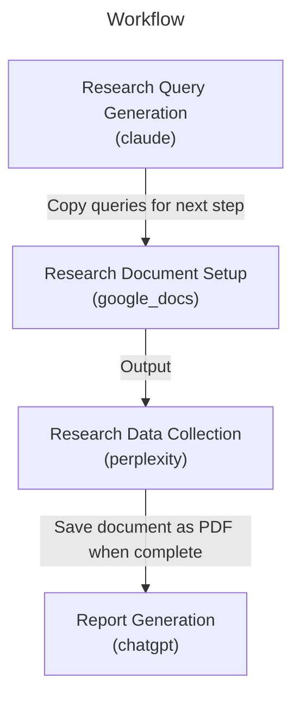

# market-analysis


A systematic approach to market analysis that combines Claude's query generation, Perplexity's research capabilities, and ChatGPT's synthesis to create comprehensive market analysis reports.

## Workflow



## Parameters

| Parameter | Required | Description | Example |
|-----------|----------|-------------|----------|
| target_market | Yes | The specific market to analyze | US smart home security market |
| time_horizon | No | Future time period for projections | 2024-2027 |


## Tools Required

### claude

- Query generation
- Research framework development

**Settings:**

- model: Claude 3.5 Sonnet

### perplexity

- Market research execution
- Data gathering

**Settings:**

- focus: Web
- enable_pro: True

### chatgpt

- Data synthesis
- Report generation

**Settings:**

- model: GPT-4o
- enable_web_search: False

### google_docs

- Research documentation
- Report organization

**Settings:**

- enable_markdown: True


## Workflow Steps
### Research Query Generation

Generate comprehensive research queries using Claude's analytical capabilities

**Usage:**
1. Create a new conversation with Claude
2. Use the provided prompt template
3. Review and refine generated queries


**Note:** Ensure queries cover market size, competitors, trends, consumer behavior, and technology/innovation aspects

### Research Document Setup

Create and format Google Doc for research documentation

**Usage:**
1. Create new Google Doc
2. Set title format: "[Current Date] - [Target Market] - Market Analysis Research"
   Example: "2024-11-25 - Smart Home Security - Market Analysis Research"
3. For each query from previous step:
   a. Paste query text
   b. Format as Heading 1
   c. Press Enter twice to leave space for response
   d. Ensure normal text formatting is set for response area


**Note:** Double-check formatting settings after each query addition

### Research Data Collection

Execute research queries and document findings

**Usage:**
For each research query in the Google Doc:
1. Copy query text
2. Execute in Perplexity
3. Wait for complete response
4. Click 'Copy' button in Perplexity response
5. Return to Google Doc
6. Paste response under corresponding query heading
7. Add blank line before next query section


### Report Generation

Synthesize research findings into comprehensive market analysis

**Usage:**
1. Upload research PDF to ChatGPT
2. Use the provided analysis prompt
3. Review output for completeness


**Note:** Ensure all data points are properly referenced in the final report

## Tips

- Review queries before execution to ensure comprehensive coverage
- Double-check formatting in Google Doc after each paste
- Let Perplexity fully complete its response before copying
- Review the full research document before running the synthesis

## Examples

### Example Usage

Parameters:
```yaml
target_market: US smart home security market
time_horizon: 2024-2027
```

Sample Queries:
- What is the total market size of the US smart home security systems industry in 2024, including DIY and professional segments, and what are the projected growth rates through 2027?
- Who are the largest smart home security companies in the US market as of 2024? Compare market share, revenue, and product offerings.

