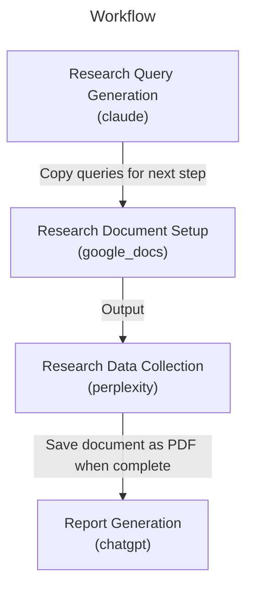

# Market Analysis

# Market Analysis Workflow

This workflow offers a systematic approach to market analysis, combining advanced AI tools to produce comprehensive, data-driven market research reports. It's designed to help businesses understand market dynamics, opportunities, and trends with unprecedented depth and efficiency.

## Overview

The workflow orchestrates three AI tools in a complementary sequence:

- Claude's analytical prowess for developing targeted market research queries
- Perplexity's robust research capabilities for gathering current market data and insights
- ChatGPT's synthesis abilities for creating coherent, comprehensive market analysis reports

## Key Benefits

1. **Comprehensive Market Understanding**: The workflow ensures thorough coverage of critical market aspects:
   - Market size and growth projections
   - Competitive landscape analysis
   - Consumer behavior patterns
   - Technology trends and innovation
   - Industry-specific dynamics

2. **Forward-Looking Analysis**: By incorporating time horizon parameters, the analysis provides not just current market snapshots but also future projections and trend analysis, enabling better strategic planning.

3. **Data-Driven Insights**: The workflow leverages Perplexity's research capabilities to gather current, factual market data, ensuring that analysis and projections are based on reliable information rather than speculation.

4. **Strategic Value**: The final output delivers actionable market intelligence that can inform:
   - Market entry strategies
   - Product development roadmaps
   - Investment decisions
   - Business expansion plans
   - Competitive positioning

This workflow is particularly valuable for businesses conducting market research, whether for new market entry, product launches, or strategic planning purposes. It provides a structured approach to gathering and analyzing market intelligence, helping organizations make informed decisions based on comprehensive market understanding.


A systematic approach to market analysis that combines Claude's query generation, Perplexity's research capabilities, and ChatGPT's synthesis to create comprehensive market analysis reports.

## Workflow



## Parameters

| Parameter | Required | Description | Example |
|-----------|----------|-------------|----------|
| target_market | No | The specific market to analyze | US smart home security market |
| time_horizon | No | Future time period for projections | 2024-2027 |


## Tools Required

### perplexity


### chatgpt


### claude


### google_docs


## Workflow Steps
### 1. Research Query Generation

Generate comprehensive research queries using Claude's analytical capabilities

**Usage:**
1. Create a new conversation with Claude
2. Use the provided prompt template
3. Review and refine generated queries


**Output:** Save queries for use in the next step (2. Research Document Setup)

**Note:** Ensure queries cover market size, competitors, trends, consumer behavior, and technology/innovation aspects

### 2. Research Document Setup

Create and format Google Doc for research documentation

**Input:** Queries from the previous step (1. Research Query Generation)

**Usage:**
1. Create new Google Doc
2. Set title format: "[Current Date] - [Target Market] - Market Analysis Research"
   Example: "2024-11-25 - Smart Home Security - Market Analysis Research"
3. For each query from the previous step (1. Research Query Generation):
   a. Paste query text
   b. Format as Heading 1
   c. Press Enter twice to leave space for response
   d. Ensure normal text formatting is set for response area


**Note:** Double-check formatting settings after each query addition

### 3. Research Data Collection

Execute research queries and document findings

**Input:** Queries from the previous step (2. Research Document Setup)

**Usage:**
For each research query in the Google Doc from the previous step (2. Research Document Setup):
1. Copy query text
2. Execute in Perplexity
3. Wait for complete response
4. Click 'Copy' button in Perplexity response
5. Return to Google Doc
6. Paste response under corresponding query heading
7. Add blank line before next query section


**Output:** Save document as PDF for use in the next step (4. Report Generation)

### 4. Report Generation

Synthesize research findings into comprehensive market analysis

**Input:** PDF from the previous step (3. Research Data Collection)

**Usage:**
1. Upload research PDF from the previous step (3. Research Data Collection)
2. Use the provided analysis prompt
3. Review output for completeness


**Note:** Ensure all data points are properly referenced in the final report

## Tips

- Review queries before execution to ensure comprehensive coverage
- Double-check formatting in Google Doc after each paste
- Let Perplexity fully complete its response before copying
- Review the full research document before running the synthesis

## Examples

### Example Usage

Parameters:
```yaml
target_market: US smart home security market
time_horizon: 2024-2027
```

Sample Queries:
- What is the total market size of the US smart home security systems industry in 2024, including DIY and professional segments, and what are the projected growth rates through 2027?
- Who are the largest smart home security companies in the US market as of 2024? Compare market share, revenue, and product offerings.

