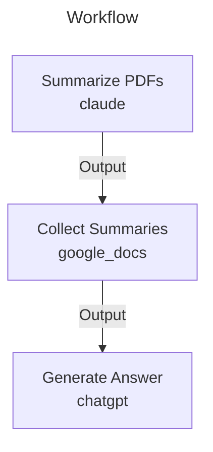

# PhD Assignment

# PhD Assignment Workflow

This workflow streamlines the process of analyzing multiple academic papers for PhD research by combining AI tools to summarize PDFs, organize findings, and generate comprehensive answers to research questions.

## Overview

The workflow orchestrates three powerful AI tools in sequence:

1. **Claude** for intelligent PDF analysis and summarization
2. **Google Docs** for organizing and structuring summaries
3. **ChatGPT** for synthesizing findings and generating answers

## Key Benefits

1. **Time Efficiency**
   - Automated paper summarization
   - Structured organization of findings
   - Quick synthesis of multiple sources

2. **Comprehensive Analysis**
   - Consistent summary structure
   - Focus on key research elements
   - Cross-paper synthesis
   - Identification of research gaps

3. **Research Quality**
   - Systematic approach to literature review
   - Standardized summary format
   - Clear traceability to source materials
   - Structured final analysis

4. **Flexibility**
   - Customizable summary prompts
   - Adaptable to different research fields
   - Scalable to any number of papers
   - Support for various research questions

## Best Practices

1. **PDF Preparation**
   - Ensure PDFs are text-searchable
   - Organize papers by topic or theme
   - Use consistent file naming
   - Verify PDF quality before processing

2. **Summary Organization**
   - Use consistent section headers
   - Add keywords and tags
   - Include page references
   - Maintain clear paper attribution

3. **Research Question**
   - Be specific and focused
   - Define clear scope
   - Include relevant parameters
   - Consider sub-questions

This workflow is particularly valuable for PhD students and researchers conducting literature reviews, meta-analyses, or systematic reviews. It provides a structured approach to processing large volumes of academic literature while maintaining high standards of research quality.


Process multiple PDFs for academic research by summarizing with Claude, collecting in Google Docs, and generating final answer with ChatGPT

## Workflow



## Parameters

| Parameter | Required | Description | Example |
|-----------|----------|-------------|----------|
| pdf_files | No | List of PDF files to process | paper1.pdf, paper2.pdf, paper3.pdf |
| research_question | No | The research question to be answered | What are the main applications and challenges of deep learning in medical imaging? |
| summary_prompt | No | Custom prompt for summarizing PDFs (optional) |  |


## Tools Required

### google_docs


### claude


### chatgpt


## Workflow Steps
### 1. Summarize PDFs

Use Claude to generate comprehensive summaries of academic papers

**Usage:**
1. For each PDF file:
   a. Upload the PDF to Claude
   b. Use the summary prompt (default or custom)
   c. Save the generated summary


**Output:** Save summaries for use in the next step (2. Collect Summaries)

### 2. Collect Summaries

Organize paper summaries in a Google Doc

**Input:** Paper summaries from the previous step (1. Summarize PDFs)

**Usage:**
1. Create a new Google Doc titled "Research Summaries - [Date]"
2. Add all PDF summaries from the previous step (1. Summarize PDFs) with clear section headers
3. Format for readability


**Output:** Save document for use in the next step (3. Generate Answer)

### 3. Generate Answer

Generate comprehensive answer to research question

**Input:** Research summaries from the previous step (2. Collect Summaries)

**Usage:**
1. Upload the Google Doc with summaries from the previous step (2. Collect Summaries)
2. Use the analysis prompt to generate answer
3. Review and refine the response


## Tips

- Use consistent section headers in Google Docs to make the summaries easy to navigate
- Consider adding tags or keywords to each summary for better organization
- If the PDFs are large, you may want to focus Claude's summary on specific sections
- Make sure to include page numbers or section references in the summaries for easy verification

## Examples

### Example Usage

Parameters:
```yaml
research_question: What are the main applications and challenges of deep learning in medical imaging?
pdf_files: paper1.pdf, paper2.pdf, paper3.pdf
```

Sample Queries:
- Summarize the methodology and findings from the papers regarding deep learning applications in medical imaging
- What are the common challenges and limitations identified across the papers?

